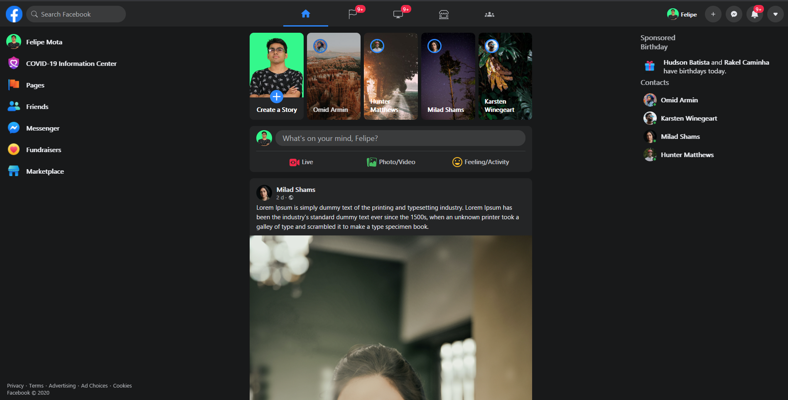

This is React Facebook Clone. A clone of the dark version of the popular social network. 

<p align="center">
  <a href="https://react-facebook-clone.vercel.app"><strong>***Demo***</strong></a>
</p>

## Install

First, clone the repo via git and install dependencies:
```bash
git clone https://github.com/felipemotabr/react-facebook-clone.git your-project-name
```

Access the directory

```bash
cd your-project-name
```

In the project directory, you can run:

```bash
$ npm install

or 

$ yarn
```

## Starting Development

Start the app

```bash
$ npm run start

or 

$ yarn start
```

Open [http://localhost:3000](http://localhost:3000) to view it in the browser.

The page will reload if you make edits.<br />
You will also see any lint errors in the console.


## Author
[Felipe Mota](https://github.com/felipemotabr)

## Contributing

Pull requests are welcome! If you see something you'd like to add, please do. For drastic changes, please open an issue first.

## License
MIT © [Facebook Clone React](https://github.com/felipemotabr/facebook-clone-react)
